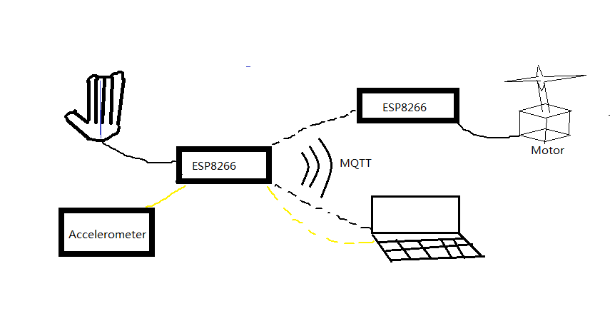

Dear professors and peers,  
We are group Kaleido, and the sensor we were allocated is a flex sensor. Flex sensor will change its resistance due to degree of bending. As you see, flex sensor is attached to a glove, and when finger bends, flex sensor catches motion change, from circuitry this is sent to ads1115, which is a analog to digital converter, and then sent to ESP8266 to process. Using MQTT component in ESP8266, information collected by sensors will be sent to another ESP8266 controller, which has a servo connected to it. When flex sensor catches degree change in glove, motor will change its degree accordingly. 
(use glove flex to drive motor)

Apart from motor, another end device is laptop. Once flex sensor catches motion i.e. a click movement, it will be converted to a space or a click in laptop.
(use glove to perform a click movement and show it can be converted to a space, using linux small game)

Possible demo
The second sensor connected to esp8266 is an accelerometer. When this sensor changes direction, i.e. upwards turned downwards, mouse will move downwards accordingly(currently very small movement). 

Probably show this picture:

